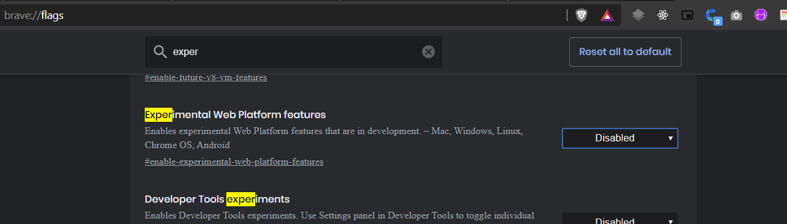
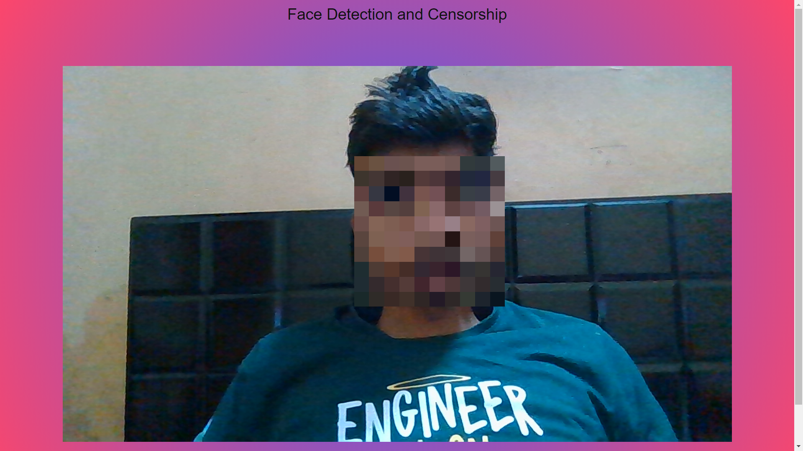

<h2 align="center">Face Detection and Censorship</h2>

  
  
  
  
  

A Face Detection and Censorship App made using JavaScript.
You can adjust censorship using controls label.

In case it's not working for you ?
That may be because I have used [FaceDetector API](https://developer.android.com/reference/android/media/FaceDetector) 

Currently this only works on Chrome and you have to enable `Experimental Web platform feature` in `chrome://flags` 

https://amanraj1608.github.io/Sketch/ 

---

 Made with ❤️ by <a href="https://github.com/amanraj1608">Aman Raj</a>

